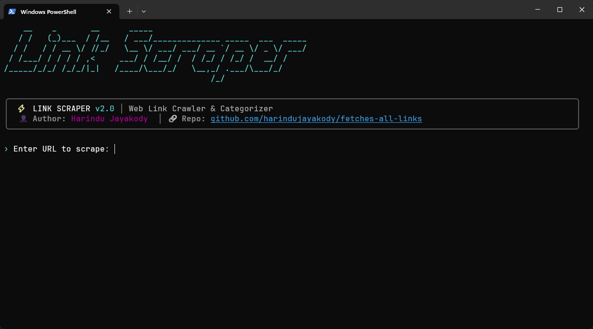
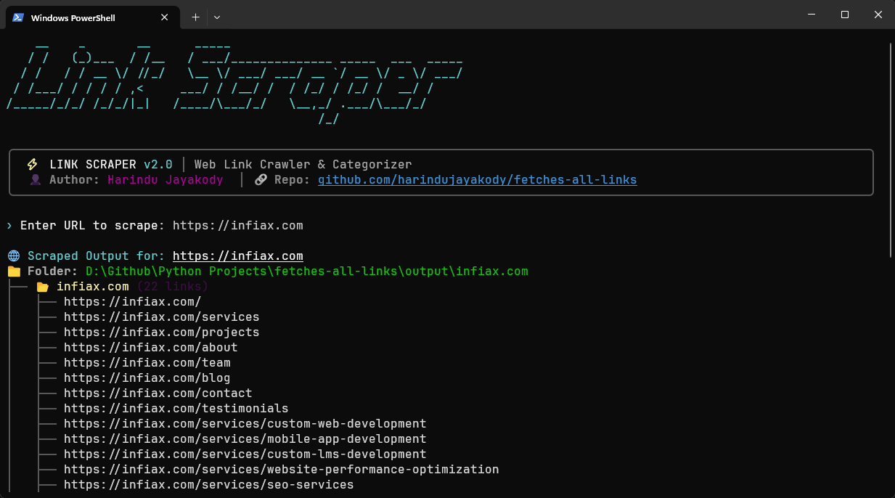
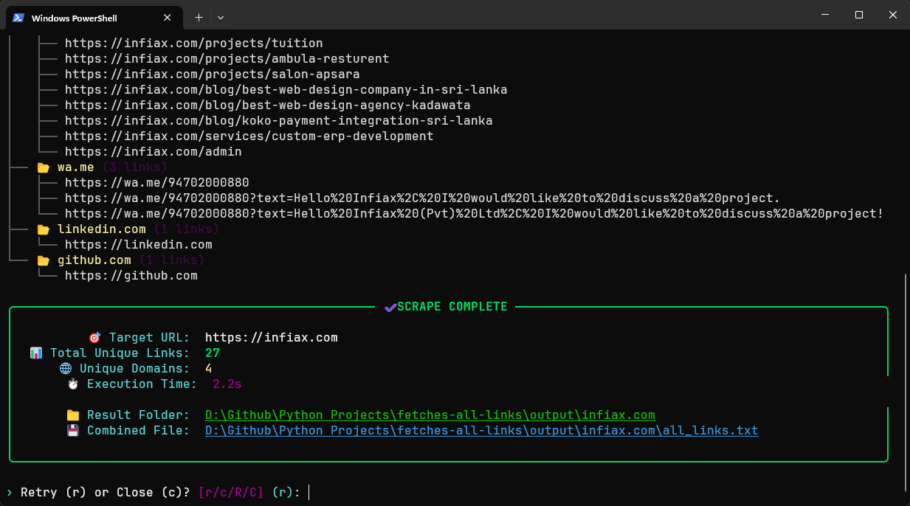

# ⚡ Web Link Scraper

<p align="center">
  
  
  
  
  
</p>

A modern, high-performance Python script that scrapes all links from any webpage, groups them into dedicated site folders (`output/<domain>/`), creates clean separate `.txt` files per domain, and formats raw links without prefixes.

---

## 📸 Interface Screenshots

<p align="center">
  
  <br/><br/>
  
  <br/><br/>
  
</p>

---

## 🌟 Key Features

- 📁 **Folder Grouping per Site**: Creates a dedicated folder for each target URL scraped (e.g. `output/cocobee.lk/`).
- 📄 **Domain Files & Combined Output**:
  - `all_links.txt`: Combined file with all scraped links categorized by domain.
  - `<domain>.txt`: Individual `.txt` files containing clean raw links for each domain (e.g. `facebook.com.txt`, `cocobee.lk.txt`).
- 🔗 **Clean Link Formatting**: No `(1)`, `(2)` prefixes before links in output files.
- ⚡ **Auto-Start & Dependency Launcher (`run.bat`)**: Single-click batch launcher that checks Python & missing dependencies automatically.
- 🎨 **Dark Modern Terminal UI**:
  - Sleek dark theme layout using `rich`.
  - Minimalist prompt (`› Enter URL to scrape`).
  - Live progress spinner.
  - Execution summary cards with time and link metrics.
- 🧹 **Terminal Auto-Cleaning**: Automatically clears terminal logs on launch and before each new scraping session.

---

## 📋 Folder Output Structure Example

When scraping `https://www.cocobee.lk/`:

```text
output/
└── www.cocobee.lk/
    ├── all_links.txt
    ├── www.cocobee.lk.txt
    ├── facebook.com.txt
    ├── instagram.com.txt
    ├── tiktok.com.txt
    ├── youtube.com.txt
    ├── pinterest.com.txt
    └── infiax.com.txt
```

### Clean Raw Link File Example (`www.cocobee.lk.txt`)
```text
https://www.cocobee.lk/
https://www.cocobee.lk/shop
https://www.cocobee.lk/sale
https://www.cocobee.lk/new-arrivals
```

---

## 🚀 Quick Start

### 1. Clone the Repository
```bash
git clone https://github.com/harindujayakody/fetches-all-links.git
cd fetches-all-links
```

### 2. Run via Batch Launcher (Windows)
Double-click `run.bat` or run:
```cmd
run.bat
```

Or run via Python directly:
```bash
python main.py
```
> **Note**: Missing dependencies (`requests`, `beautifulsoup4`, `pyfiglet`, `colorama`, `rich`) will be auto-detected and installed automatically on your first run!

---

## 📦 Manual Installation (Optional)

If you prefer to install dependencies manually via `requirements.txt`:

```bash
pip install -r requirements.txt
```

---

## 👤 Author

Developed with ❤️ by **Harindu Jayakody**
- **GitHub**: [@harindujayakody](https://github.com/harindujayakody)

---

## 📄 License

This project is licensed under the [MIT License](LICENSE).
